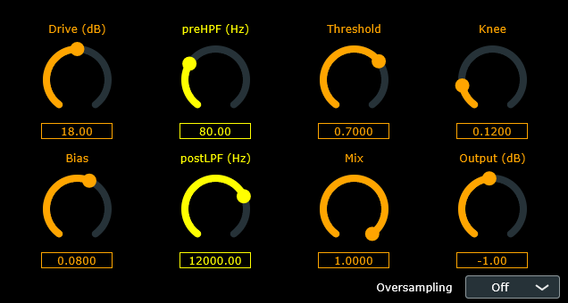
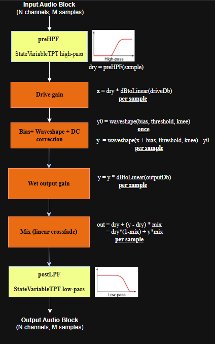

# HTekDistortion Plugin

## Description
A piecewise, memoryless soft-knee hard clipper, where the knee transition is implemented by smoothstep interpolation between linear and saturated regions, with optional bias and baseline subtraction (DC compensation).



### Drive (driveDb)

Higher drive pushes more signal into the knee/clip region, thus gives more distortion and loudness (unless compensated).

### preHPF

High-pass filter cutoff (StateVariableTPTFilter highpass) that runs before the waveshaper. User has the ability to remove low frequencies before clipping so bass doesn't dominate the distortion.

### Threshold (threshold)

Sets the clip ceiling. Increasing threshold allows higher peaks through → often louder and less saturated.

### Knee (knee)

Controls the width of the knee region around the threshold. Knee uses smoothstep interpolation between linear and clipped output. If knee is zero we have a very hard clip behavior (more harsh highs/aliasing). With a higher knee we have a smoother transition and softer distortion character.

### Bias (bias)

Adds a DC offset before shaping: `waveshape(x + b, ...)`. Creates even harmonics and a more "dirty" tone breaking the odd-symmetric property of the transfer curve.

### postLPF
Low-pass filter cutoff (StateVariableTPTFilter lowpass) that runs after the waveshaper (and after mix). Removes high harmonics created by clipping and can remove hissing sounds that come from high frequencies, resulting in a less fizzy distortion.

### Mix (mix)

Wet/dry blend between the current sample (dry) and waveshaped sample (y). Mix=0 yields the filtered clean path (preHPF then postLPF). Mix=1 yields fully distorted (then postLPF).

### Output (outputDb)

Applied to the distorted (wet) signal after waveshaping (before mix) for level trim.

### Oversampling (pending)
Should be used to reduce aliasing artifacts introduced by the nonlinearity by processing at a higher sample rate and filtering before downsampling (pending).

## Distortion Algorithm


## Configure Libraries
* ### JUCE_LIB

  The project supports local JUCE checkout (via `JUCE_LIB`) or automatic fetching using CMake FetchContent (if environment variable `JUCE_LIB` is not set). 
  
  If you want to set the environment variable execute:

  **Windows (Powershell)**
  
  Temporary:
  ```
  $env:JUCE_LIB="\absolute\path\to\JUCE"
  ```
  
  Persistent:
  ```
  setx JUCE_LIB "\absolute\path\to\JUCE"
  ```
  
  **Linux / macOS**
  
  Temporary (current shell session only):
  ```
  export JUCE_LIB="/absolute/path/to/JUCE"
  ```

  Persistent (add to ~/.bashrc, ~/.zshrc, etc):
  ```
  echo 'export JUCE_LIB="/absolute/path/to/JUCE"' >> ~/.bashrc
  source ~/.bashrc
  ```
  Define the environment variable `JUCE_LIB` to reference the JUCE source root directory (the directory containing `CMakeLists.txt` and `modules/`). 
  
  If you use a different environment variable name in your build system, replace `JUCE_LIB` in `CMakeLists.txt` accordingly with your defined environment variable name. JUCE modules are statically linked into the plugin for easy distribution, thus object code is embedded into your plugin binary. But, the plugin itself is a dynamic library.


    <ins>*Using the same logic you can setup your environment variable `CATCH2_LIB` to be able to run the tests in `effects/tests`*.</ins>

* ### CATCH2_LIB
    `CATCH2_LIB` must point to the Catch2 source root (contains CMakeLists.txt).

    **Windows (PowerShell)**

    Temporary:
    ```
    $env:CATCH2_LIB="\absolute\path\to\Catch2"
    ```
    Persistent:
    ```
    setx CATCH2_LIB "\absolute\path\to\Catch2"
    ```

    ### Linux / macOS

    Temporary:
    ```
    export CATCH2_LIB="/absolute/path/to/Catch2"
    ```
    Persistent (add to ~/.bashrc, ~/.zshrc, etc):
    ```
    echo 'export CATCH2_LIB="/absolute/path/to/Catch2"' >> ~/.bashrc
    source ~/.bashrc
    ```


**Windows (GUI):**

 Alternatively, define JUCE_LIB and CATCH2_LIB as User Environment Variables in Environment Variables (View Advanced System Settings -> Environment Variables).

### Downloads

- **JUCE** repository: https://github.com/juce-framework/JUCE

- **Catch2** repository: https://github.com/catchorg/Catch2

- **CMake** source and binary distributions: https://cmake.org/download/

- **Note**: As we will see in the next section, one can choose not to build with tests and have the plugin only. Tests are here for assuring the quality of the development process.

---

## Build Project
You can build the plugin in **Debug** or **Release** mode. In your project root directory execute:

* ### Debug
    #### Windows
    ```
    cmake -B build
    cmake --build build
    ```
    (Adding `--config Debug` works the same but is unnecessary, since this is done by default)

    #### Linux/macOS
    ```
    cmake -B build -DCMAKE_BUILD_TYPE=Debug
    cmake --build build
    ```

* ### Release
    #### Windows
    ```
    cmake -B build
    cmake --build build --config Release
    ```

    #### Linux/macOS
    ```
    cmake -B build -DCMAKE_BUILD_TYPE=Release
    cmake --build build
    ```

Plugin artefacts are under `build/plugin/*_artefacts/*/VST3/....`


### Build with tests

If you want to build with tests, then execute:

    cmake -B build -DBUILD_TESTS=ON

before `cmake --build <build_folder>` .

Test binary will be under `build/effects/tests/` (`.../Debug/HTekEffectsTests.exe` on Windows).

---