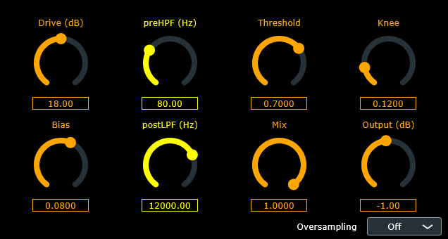
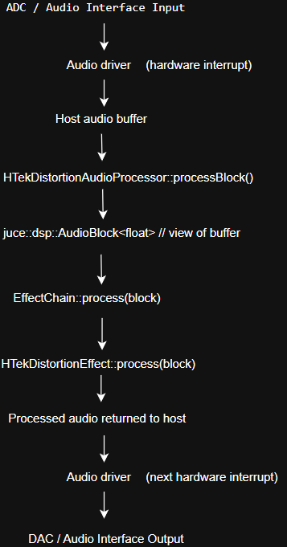
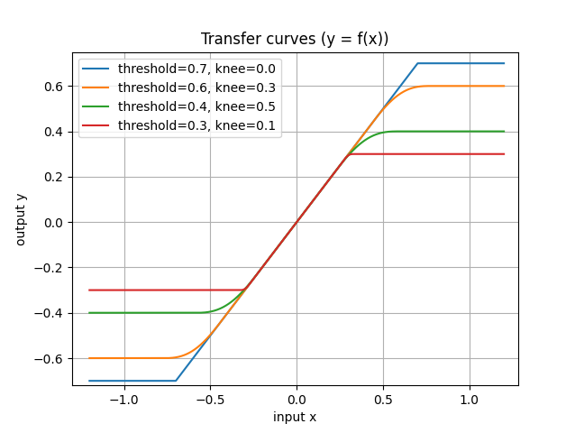
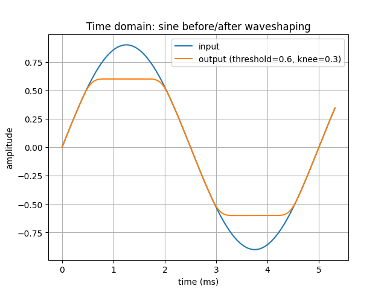
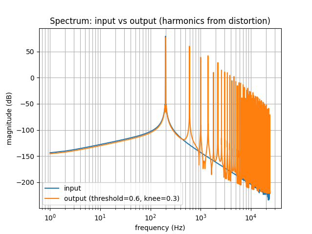
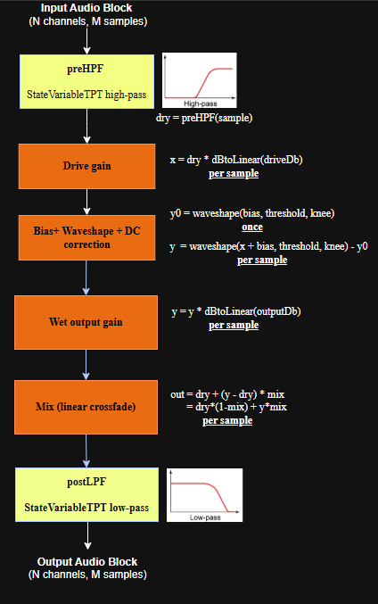

# HTekDistortion Plugin

## Description
A piecewise, memoryless soft-knee hard clipper, where a monotonic quartic curve smoothly transitions from the linear region into hard saturation without foldback, with optional bias and baseline subtraction for DC compensation.



### Drive (driveDb)

Higher drive pushes more signal into the knee/clip region, thus gives more distortion and loudness (unless compensated).

### preHPF

High-pass filter cutoff (`StateVariableTPTFilter` highpass) that runs before the waveshaper. User has the ability to remove low frequencies before clipping so bass doesn't dominate the distortion.

### Threshold (threshold)

Sets the clip ceiling. Increasing threshold allows higher peaks through, often louder and less saturated.

### Knee (knee)

Controls the width of the transition region around the threshold. The knee uses a monotonic C<sup>2</sup> quartic curve to smoothly reduce the transfer slope from the linear region into hard clipping. With `knee = 0`, the waveshaper behaves like a hard clipper, producing stronger high-order harmonics and more aliasing. Increasing the knee widens the transition, producing a smoother and softer distortion character.

The original sign of $x$ is restored after this magnitude mapping.
### Bias (bias)

Adds a DC offset before shaping: `waveshape(x + b, ...)`. Creates even harmonics and a more "dirty" tone breaking the odd-symmetric property of the transfer curve.

### postLPF
Low-pass filter cutoff (StateVariableTPTFilter lowpass) that runs after the waveshaper (and after mix). Removes high harmonics created by clipping and can remove hissing sounds that come from high frequencies, resulting in a less fizzy distortion.

### Mix (mix)

Wet/dry blend between the current sample (dry) and waveshaped sample (y). Mix=0 yields the filtered clean path (preHPF then postLPF). Mix=1 yields fully distorted (then postLPF).

### Output (outputDb)

Applied to the distorted (wet) signal after waveshaping (before mix) for level trim.

### Oversampling (pending)
Should be used to reduce aliasing artifacts introduced by the nonlinearity by processing at a higher sample rate and filtering before downsampling (pending).

## Signal flow from input to output



Here we assume that the entire processing graph in the DAW contains only the HTekDistortion plugin.

## Distortion Algorithm
### Waveshapers


### Before VS After Waveshaping


### Spectrum Before VS After Waveshaping


### HTEKDistortionEffect::process(block)



## Configure Libraries
* ### JUCE_LIB

  The project supports local JUCE checkout (via `JUCE_LIB`) or automatic fetching using CMake FetchContent (if environment variable `JUCE_LIB` is not set). 
  
  If you want to set the environment variable execute:

  **Windows (Powershell)**
  
  Temporary:
  ```
  $env:JUCE_LIB="\absolute\path\to\JUCE"
  ```
  
  Persistent:
  ```
  setx JUCE_LIB "\absolute\path\to\JUCE"
  ```
  
  **Linux / macOS**
  
  Temporary (current shell session only):
  ```
  export JUCE_LIB="/absolute/path/to/JUCE"
  ```

  Persistent (add to ~/.bashrc, ~/.zshrc, etc):
  ```
  echo 'export JUCE_LIB="/absolute/path/to/JUCE"' >> ~/.bashrc
  source ~/.bashrc
  ```
  Define the environment variable `JUCE_LIB` to reference the JUCE source root directory (the directory containing `CMakeLists.txt` and `modules/`). 
  
  If you use a different environment variable name in your build system, replace `JUCE_LIB` in `CMakeLists.txt` accordingly with your defined environment variable name. JUCE modules are statically linked into the plugin for easy distribution, thus object code is embedded into your plugin binary. But, the plugin itself is a dynamic library.


    <ins>*Using the same logic you can setup your environment variable `CATCH2_LIB` to be able to run the tests in `effects/tests`*.</ins>

* ### CATCH2_LIB
    `CATCH2_LIB` must point to the Catch2 source root (contains CMakeLists.txt).

    **Windows (PowerShell)**

    Temporary:
    ```
    $env:CATCH2_LIB="\absolute\path\to\Catch2"
    ```
    Persistent:
    ```
    setx CATCH2_LIB "\absolute\path\to\Catch2"
    ```

    ### Linux / macOS

    Temporary:
    ```
    export CATCH2_LIB="/absolute/path/to/Catch2"
    ```
    Persistent (add to ~/.bashrc, ~/.zshrc, etc):
    ```
    echo 'export CATCH2_LIB="/absolute/path/to/Catch2"' >> ~/.bashrc
    source ~/.bashrc
    ```


**Windows (GUI):**

 Alternatively, define JUCE_LIB and CATCH2_LIB as User Environment Variables in Environment Variables (View Advanced System Settings -> Environment Variables).

### Downloads

- **JUCE** repository: https://github.com/juce-framework/JUCE

- **Catch2** repository: https://github.com/catchorg/Catch2

- **CMake** source and binary distributions: https://cmake.org/download/

- **Note**: As we will see in the next section, one can choose not to build with tests and have the plugin only. Tests are here for assuring the quality of the development process.

---

## Build Project
You can build the plugin in **Debug** or **Release** mode. In your project root directory execute:

* ### Debug
    #### Windows (Visual Studio / multi-config)
    ```
    cmake -B build 
    cmake --build build --config Debug
    ```
    #### Windows (Ninja / single-config)
    ```
    cmake -B build -G Ninja -DCMAKE_BUILD_TYPE=Debug
    cmake --build build
    ```
    #### macOS (Xcode / multi-config)
    ```
    cmake -B build -G Xcode
    cmake --build build --config Debug
    ```
    #### Linux/macOS (Ninja/Makefiles / single-config)
    ```
    cmake -B build -DCMAKE_BUILD_TYPE=Debug
    cmake --build build
    ```
* ### Release
    #### Windows (Visual Studio / multi-config)
    ```
    cmake -B build 
    cmake --build build --config Release
    ```
    #### Windows (Ninja / single-config)
    ```
    cmake -B build -G Ninja -DCMAKE_BUILD_TYPE=Release
    cmake --build build
    ```

    #### macOS (Xcode / multi-config)
    ```
    cmake -B build -G Xcode
    cmake --build build --config Release
    ```
    #### Linux/macOS (Ninja/Makefiles / single-config)
    ```
    cmake -B build -DCMAKE_BUILD_TYPE=Release
    cmake --build build
    ```
Plugin artefacts are under `build/plugin/*_artefacts/*/VST3/....`


### Build with tests

If you want to build with tests, then execute:

    cmake -B build -DBUILD_TESTS=ON

before `cmake --build <build_folder>` .

Test binary will be under `build/effects/tests/` (`.../Debug/HTekEffectsTests.exe` on Windows).

---

## Appendix 

### Waveshaper 
Check `effects/Distortion.cpp` function `waveshape()`.

For an input audio sample $x$, let $f(x)$ be the output audio sample where

For $k>0$,

```math
f(x)=
\begin{cases}
x, & |x|\le a
\qquad\qquad \text{Region 1: linear}
\\
\mathrm{sgn}(x)\cdot\left[a+(b-a)\cdot q(u)\right],
& a\lt|x|\lt b
\qquad\text{Region 2: knee}
\\
\mathrm{sgn}(x)\cdot t,
& |x|\ge b
\qquad\qquad\hspace{0.065cm}\text{Region 3: hard clip}
\end{cases}
```
with

- $$a=t \cdot (1-k), \qquad b=t \cdot (1+k) $$

- $$u= \frac{|x|-a}{b-a} $$

- $$q(u)=u-u^3+\frac{1}{2}u^4 $$


where

- $x$: input audio sample.
- $t$: clipping threshold; the maximum output magnitude after saturation.
- $k$: knee parameter controlling the width of the transition region.
- $a$: start of the knee region.
- $b$: end of the knee region.
- $u$: normalized position of the input magnitude inside the knee.
- $q(u)$: quartic function whose role is to curve the normalized knee transition.
- $\mathrm{sgn}(x)$: restores the sign of the original input sample.

For $k=0$, since $a=b=t$,

```math
f(x)=
\begin{cases}
x, & |x|\le t \\
\mathrm{sgn}(x)\cdot t, & |x|>t
\end{cases}
```

<hr style="border: 1px solid gray;">

#### Region 1 / Linear
##### Case 1 $(k>0)$:

For

$$
|x|\le a,
$$

the input sample passes through unchanged:

$$
f(x)=x.
$$

The slope is

$$
f'(x)=1.
$$

At the boundary $|x|=a$, the quartic knee joins the linear region with the same slope,

$$
q'(0)=1,
$$

so $f'(x)$ remains continuous there.

---

##### Case 2 $(k=0)$:

When

$$
k=0,
$$

we have

$$
a=b=t.
$$

The linear region becomes

$$
|x|\le t,
$$

with

$$
f(x)=x.
$$

For the interior $|x|\lt t,$ the slope is $f'(x)=1.$

At the boundary points

```math
x \in \{-t,t\}
```

the derivative does not exist, because the linear region joins directly to the hard-clipped region.

<hr style="border: 1px solid gray;">

#### Region 3 / Hard Clip

##### Case 1 $(k>0)$:

For

$$
|x|\ge b,
$$

the output magnitude is fixed at the clipping threshold:

$$
f(x)=\mathrm{sgn}(x)\cdot t.
$$

Therefore,

$$
|f(x)|=t.
$$

The slope is

$$
f'(x)=0.
$$

At the boundary $|x|=b$, the quartic knee joins the hard-clipped region with the same slope,

$$
q'(1)=0,
$$

so $f'(x)$ remains continuous there.

---

##### Case 2 $(k=0)$:

When

$$
k=0,
$$

we have

$$
a=b=t.
$$

The hard-clipped region becomes

$$
|x|\ge t,
$$

with

$$
f(x)=\mathrm{sgn}(x)\cdot t.
$$

For the interior $|x|>t,$ the slope is $f'(x)=0$.

At the boundary points

```math
x \in \{-t,t\}
```


the derivative does not exist, because the linear region joins directly to the hard-clipped region.

<hr style="border: 1px solid gray;">

#### Region 2 / C<sup>2</sup> Quartic Knee

Notice that the knee branch is never reached for $k=0$, because in that case, the knee region is empty and the waveshaper
reduces to a hard clipper ($a=b=t$).

Therefore, if $a<|x|<b$ and $k>0$, then $|x|$ falls inside the knee region.

The input magnitude is mapped from the knee interval

$$
|x| \in (a,b)
$$

to a normalized position

$$
u \in (0,1)
$$

using

$$
u = \frac{|x|-a}{b-a}.
$$

So that

$$
|x| \rightarrow a^+ \Leftrightarrow u\rightarrow 0^+
$$

and

$$
|x| \rightarrow b^- \Leftrightarrow u\rightarrow 1^-.
$$

The normalized position is then passed through the quartic transition

$$
q(u)=u-u^3+\frac{1}{2}u^4.
$$

For this quartic,

$$
\lim_{u\to0^+}q(u)=0
$$

and

$$
\lim_{u\to1^-}q(u)=\frac12.
$$


so the mapping is

$$
u \in (0,1)
\quad\longrightarrow\quad
q(u) \in \left(0,\frac12\right)
$$

Also

$$
q'(u)=1-3u^2+2u^3=(1-u)^2(2u+1)
$$

and

$$
q''(u)=-6u(1-u).
$$

Therefore:

- $q'(0)=1$: the knee joins the linear region with slope 1.
- $q'(1)=0$: the knee joins the clipped region with slope 0.
- $q''(0)=q''(1)=0$: the second derivative matches at both joins.
- $q'(u)>0$ for $u \in (0,1)$: the knee is strictly monotonic and has no foldback.

The quartic value is then mapped back to an output magnitude:

$$
|f(x)|=a+(b-a)q(u).
$$

Since

$$
q(u) \in \left(0,\frac{1}{2}\right),
$$

the output magnitude maps as

$$
|f(x)| \in \left(a,\frac{a+b}{2}\right).
$$

Because

$$
a=t(1-k), \qquad b=t(1+k),
$$

we have

$$
\frac{a+b}{2}=t.
$$

Therefore,

$$
|f(x)| \in (a,t).
$$

Therefore the complete knee mapping is

$$
|x| \in (a,b)
\quad\longrightarrow\quad
u \in (0,1)
\quad\longrightarrow\quad
q(u) \in \left(0,\frac12\right)
\quad\longrightarrow\quad
|f(x)| \in (a,t).
$$

Finally, the original input sign is restored:

$$
f(x)=\mathrm{sgn}(x) \cdot |f(x)|
$$
<hr style="border: 1px solid gray;">